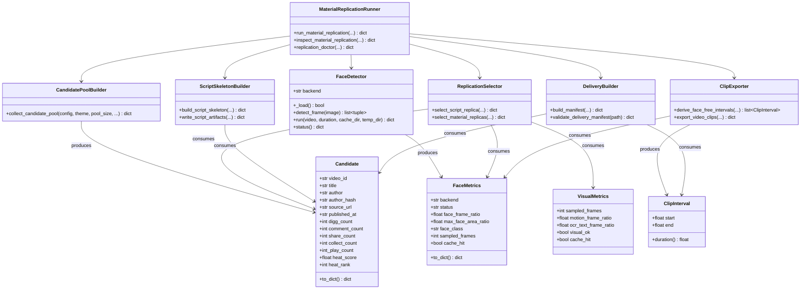
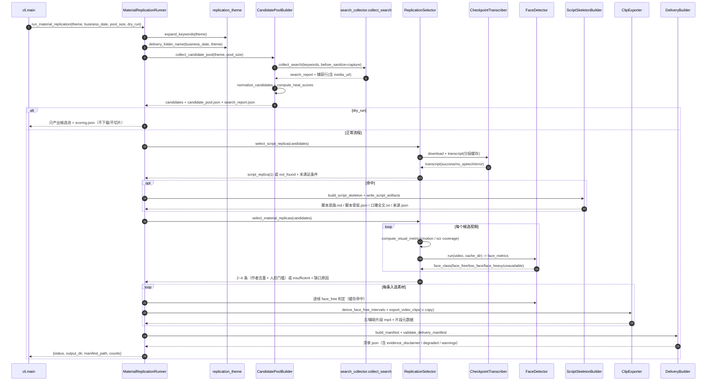

# 单次开发指导文档：主题驱动的抖音「素材复刻」采集与交付工作流

- 日期：2026-09-12
- 状态：设计完成，待实现
- 项目：`douyin-content-intelligence` v0.3.0
- 上游需求：`docs/tasks/2026-09-12-material-replication-PRD.md`（本文件为其架构与实现落地指南）
- 关联任务：Task #1（PRD）→ **Task #2（本文档）** → Task #3（实现）→ Task #4（验证）
- 依据事实：`AGENTS.md`、`docs/handoff/README.md`、`docs/handoff/CURRENT_STATUS.md`、`docs/handoff/CODE_MAP.md`、`docs/handoff/RUNTIME_SAFETY.md`、`docs/handoff/PRODUCT_RULES.md`

> 本文件是项目契约要求的 task guide，冻结本期目标、范围、决策、交付物、排除项、安全边界与验收测试。

---

## 1. 目标

在现有「抖音科技内容情报供应层」之上新增一条**主题驱动的素材复刻采集与交付工作流**：用户给一个主题（如「苹果折叠屏手机」），系统一次运行产出

1. **1 个「脚本复刻视频」**的结构化脚本骨架（`脚本思路.md` / `脚本骨架.json` / `口播全文.txt` / `来源.json`）；
2. **2~4 个「素材复刻视频」片段**（主素材 / 辅助素材，全部 `face_free`，3~8 秒，附片段元数据）；
3. 一个符合 `MM.DD<主题>复刻视频/` 规范的交付目录 + `清单.json`（含 `evidence_disclaimer`）。

优先级（PRD §1.3）：**速度 > 准确度**；**「少人脸」是交付硬门槛**，速度/准确度与「无人脸」冲突时以排除人脸为准。

---

## 2. 范围

### 2.1 范围内（本期交付）

| 需求 | 落地要点 |
| --- | --- |
| P0-1 主题输入与关键词扩展 | 主题 → 3~6 关键词，复用 `search_collector.controlled_keywords()` 的去重与 10 词上限 |
| P0-2 主题化候选池采集 | 复用 `collect_search()`，`before_sanitize` 捕获含 `video_download_url` 的原始行；产出 `candidate_pool.json` + `search_report.json` |
| P0-3 脚本复刻视频筛选（1 个） | heat 排名 Top10%（至少 Top5）+ 口播密度 + 时长 + 可转写；确定性排序 |
| P0-4 脚本思路提取 | 离线启发式分段（不依赖 LLM）；四件套交付；ASR 失败降级 |
| P0-5 素材复刻视频筛选（2~4 个） | 画面变化率 / OCR 覆盖 + 低口播 + 时长 + 热度中位数 + 作者去重 + 人脸门槛 |
| P0-6 人脸检测与少人脸排序 | **两级回退**（见 §3.3）；采样复用 `KeyframeOCR` 的 ffmpeg pattern；`face_free/low_face/face_heavy/unavailable` 分级 |
| P0-7 批量下载与片段导出 | 复用 `download_video()` / `probe_video()`；3~8 秒无人脸区间；`ffmpeg -c copy` 无损切片；无 ffmpeg 降级 |
| P0-8 交付目录与清单规范 | `MM.DD<主题>复刻视频/`；清单 schema 对齐 PRD §4；一次性发布，绝不半覆盖 |
| P0-9 CLI 与可运行性 | `material-replication run/inspect/doctor`；`--dry-run` 不下载不切片；不改动 26 个既有子命令 |

### 2.2 排除项（Explicit Non-Goals，对齐 PRD §6）

- 不做视频拼接 / 剪映草稿；不做 TTS、字幕烧录、成片渲染；不做平台发布/投放。
- 不做人脸识别（只做存在性检测，不产特征向量、不存人脸截图、不识别身份）。
- 不做版权判定与授权谈判；不做风控规避；不做历史存量素材回溯。
- 不做素材源扩展（本期只解决抖音侧供应）；不修改 `third_party/MediaCrawler`。
- 不改动既有 26 个 CLI 子命令语义；不引入 `torch/insightface/mediapipe/dlib/onnxruntime` 等新原生依赖。
- P1/P2（镜头边界切分、并行、水印剔除、工作台集成、LLM 增强）本期不做，仅预留扩展点。

### 2.3 安全边界（对齐 PRD §5.3）

- 不读取/复制/提交 Cookie、API Key、浏览器用户目录、`.env.local`。
- 抖音素材仅作**发现与关注度证据**，不得作为事实依据；清单必须含 `evidence_disclaimer`。
- **有界执行**：所有网络/浏览器/模型/子进程操作必须有有限预算与超时并逐级降级。
- **清理禁用 `shutil.rmtree`**：只用逐文件 `unlink()` + `rmdir()`（沿用 `media_processing.py` 的 `try/except OSError` 模式）。
- 下载素材与交付目录不入版本库；人脸数据只存比例/面积指标。
- 不用 `os.kill(pid, 0)`，不用信号探测 PID（见 `RUNTIME_SAFETY.md`）。

---

## 3. 实现方案与框架选型

### 3.1 总体策略：新增平铺模块，复用既有编排

项目既有源码为 `src/douyin_intelligence/` 下的**平铺模块**（无子包）。本期沿用该约定，新增 8 个平铺模块，全部**贴着现有函数签名**写，绝不重复发明采集/下载/转写/抽帧/写盘能力：

| 新增模块 | 复用现有资产 | 新增职责 |
| --- | --- | --- |
| `face_metrics.py` | `resolve_media_tool`、`KeyframeOCR` 的 ffmpeg 抽帧 pattern | 人脸两级回退、采样、分级、缓存 |
| `replication_theme.py` | `search_collector.controlled_keywords` 去重/上限语义 | 主题→关键词扩展、主题 sanitize、交付目录命名 |
| `replication_candidates.py` | `collect_search(before_sanitize=…)`、`normalize_record`、`atomic_write_json` | 捕获 media_url、候选归一化、heat_score |
| `replication_selection.py` | `CheckpointTranscriber`、`KeyframeOCR`、`probe_video` | 画面代理指标、三类筛选与确定性排序 |
| `replication_script.py` | `CheckpointTranscriber` 的分段产物 | 离线启发式脚本分段与四件套 |
| `replication_clips.py` | `download_video`、`resolve_media_tool("ffmpeg")`、`probe_video` | 区间反推、无损切片、降级、逐文件清理 |
| `replication_delivery.py` | `exporter.atomic_write_json` | 目录树、清单/片段 schema、`validate_*`、disclaimer |
| `replication_pipeline.py` | 以上全部 + `doctor` 语义 | 端到端编排、超时预算、`inspect`、`doctor` |

**关键技术约束（必须遵守）**：`collect_search()` 与 `collect_creators()` 都会调用 `artifact_safety.sanitize_raw_files()`，而 `sanitize_raw_file()` 的 `_canonical_row()` **会删除 `video_download_url`**（`_SENSITIVE_FIELD` 命中 `video_(?:download_)?url`）。因此**下载所需的完整 URL 必须在 sanitize 之前用 `before_sanitize` 回调捕获到内存**（即 `visual_anchor._collect_douyin_clues` 已验证的模式），`candidate_pool.json` 落盘时**不含**签名 URL（仅保留 `video_id`/`share_url`/`media_url_present` 布尔）。

### 3.2 架构模式

- **分层 + 编排器**：`replication_pipeline` 作为 Orchestrator，串起 Candidate → Select → Script/Clip → Delivery；各层互不感知对方内部实现。
- **依赖注入便于离线测试**：所有外部副作用（browser 采集、下载、ffmpeg、ASR、人脸模型、时钟）都可经参数/monkeypatch 替换；纯计算函数（分级、区间反推、heat 归一化、排序）保持无副作用。
- **原子发布**：交付目录先写 `data/temp/material-replication/...` 暂存区，再 `os.replace` 到最终目录（沿用 `material_probe._publish_directory` 思路，但**清理用逐文件 unlink + rmdir**）。
- **证据分级贯穿**：清单顶层 `degraded` / `insufficient` / `warnings` 显式暴露「哪些是证据、哪些是猜测」。

### 3.3 人脸检测模块完整设计（P0-6，硬约束）

**技术路线（两级回退，纠正 PRD §P0-6 的三级回退）**

本机实测：`cv2` 5.0.0 可用，`cv2.FaceDetectorYN` 与 `cv2.dnn` 均存在；但 `cv2.CascadeClassifier` **在 OpenCV 5.0 已被移除**，故 PRD 的「Haar」一级不可实现。`onnxruntime` 1.29.0 本机 import 直接失败（老 `msvcp140.dll` 坑），YuNet 经 OpenCV 自带 dnn 后端**不经过 onnxruntime 包**，已实测创建 + 推理成功。故：

| 级别 | 后端 | 载入方式 | 触发条件 |
| --- | --- | --- | --- |
| 1（首选） | `opencv_yunet` | `cv2.FaceDetectorYN.create(model_path, "", (w, h), score_threshold, nms, top_k)` | 模型文件存在且 cv2 可用 |
| 2（兜底） | `opencv_dnn` | `cv2.dnn.readNetFromCaffe(prototxt, weights)`（res10 SSD） | 配置了 res10 模型文件 |
| 3（降级） | `unavailable` | — | 前两级均不可用 |

**模型来源与分发（PRD 未说明，必须明确）**

- **存放位置**：`jobs.material_replication.face.model_root` = `data/models/face/`（项目内相对路径；`data/models/` 已在 `.gitignore`）。
- **文件**：`face_detection_yunet_2023mar.onnx`，**232,589 字节**，来源 `https://github.com/opencv/opencv_zoo/raw/main/models/face_detection_yunet/face_detection_yunet_2023mar.onnx`（实测 1.2 秒下载完成）。
- **首次获取**：`ensure_yunet_model(config)`：① 若配置路径已存在且字节数匹配 `expected_bytes`（可选校验 `sha256`）→ 直接返回；② 否则当 `auto_download=true` 时**有界下载**（`urllib.request`，`download_timeout_seconds`，先写 `.part` 再 `os.replace`，字节数/大小上限校验）→ 返回路径；③ 下载失败/禁用 → 返回 `None`。
- **交付时获取**：本机已有 `/tmp/yunet.onnx`（主理人已下载，232,589 字节）；实现完成时**复制到 `data/models/face/face_detection_yunet_2023mar.onnx`** 供实跑，无需依赖下载。
- **离线不可得降级**：返回 `None` → `face_class="unavailable"`、`status="unavailable"`、清单 `face_backend_status="unavailable"`、`degraded=true`；**仍产出素材并给出警告，不崩溃**。
- **二级 dnn 回退**：保留代码路径（`opencv_dnn`），但 res10 的 `prototxt/weights` 本机不存在；默认**不下载**，仅当用户显式配置了本地文件才启用。否则视为 `unavailable`。
- **测试绝不依赖真实下载或真实模型**：测试 monkeypatch `ensure_yunet_model` / 注入 fake detector，或对 `classify_face` / `face_frame_hits` 等纯函数直接断言（见 §7）。

**采样参数（复用 `KeyframeOCR` 的同一 ffmpeg pattern，保证一致性与缓存复用）**

复用 `media_processing.KeyframeOCR.run()` 中的命令形态：`[ffmpeg, "-y","-v","error","-i", video, "-vf", f"fps=1/{interval},scale='min({width},iw)':-2", "-frames:v", str(max_frames), pattern]`，其中 `interval = face.sampling_interval_seconds`（=1，即 `fps=1/1`）、`width = face.frame_width`（=960）、`max_frames = face.max_frames`（=120）。

| 参数 | 值（配置默认） |
| --- | --- |
| 采样频率 | `fps=1`（1 帧/秒） |
| 单视频上限 | `max_frames = 120` |
| 帧宽 | `scale='min(960,iw)':-2` |
| 计入人脸的框面积比 | `min_face_area_ratio = 0.015`（低于视为远处不可辨识，不计入） |

**指标与分级**

| 指标 | 定义 |
| --- | --- |
| `face_frame_ratio` | 命中人脸的采样帧数 / 采样帧总数 |
| `max_face_area_ratio` | 单帧最大人脸框面积 / 该帧面积 |
| `face_class` | `face_free`（≤5%）/ `low_face`（5%<x≤15%）/ `face_heavy`（>15%）/ `unavailable` |

排序优先级：`face_free` > `low_face` > `face_heavy`（后者不进交付）；同档内按 `heat_score` 降序。

**性能**：1280×720 实测 21.1 ms/帧（含 warmup，10 次平均）；960 宽更快，PRD「≥8 帧/秒」轻松达成。注意 OpenCV 推理会打印一条无害告警 `Targets are not supported by the new graph engine for now`——**不得当错误处理**。

**只做存在性检测**：`FaceMetrics` 只落比例/面积，不产出特征向量、不保存人脸截图、不识别身份。

### 3.4 与现有模块的协作（数据流）

```
cli.material-replication run
  → replication_pipeline.run_material_replication
    → replication_theme.expand_keywords / delivery_folder_name
    → replication_candidates.collect_candidate_pool
        → search_collector.collect_search(before_sanitize=capture)   # 捕获含 media_url 的原始行
        → normalize.normalize_record                                  # 归一化
        → replication_candidates.compute_heat_scores                  # 池内归一化，处理 play_count 缺失
    → replication_selection.select_script_replica
        → materials.download_video / probe_video / media_processing.CheckpointTranscriber
    → replication_script.write_script_artifacts
    → replication_selection.select_material_replicas
        → media_processing.KeyframeOCR + replication_selection.compute_visual_metrics
        → face_metrics.FaceDetector.run
    → replication_clips.export_video_clips
        → materials.download_video / media_tools.resolve_media_tool("ffmpeg")
    → replication_delivery.build_manifest / validate_delivery_manifest
  → exporter.atomic_write_json（清单与过程数据）
```

---

## 4. 文件列表

### 4.1 新增源码（`src/douyin_intelligence/`）

| 文件 | 说明 |
| --- | --- |
| `face_metrics.py` | 人脸两级回退、模型 provision、采样、分级、缓存 |
| `replication_theme.py` | 主题→关键词扩展、主题 sanitize、交付目录命名与路径长度校验 |
| `replication_candidates.py` | 候选池采集编排、候选记录归一化、heat_score |
| `replication_selection.py` | 画面代理指标、脚本/素材筛选、作者去重、确定性排序 |
| `replication_script.py` | 离线脚本骨架分段与四件套产出 |
| `replication_clips.py` | 无人脸区间反推、无损切片、降级、逐文件清理 |
| `replication_delivery.py` | 交付目录树、清单/片段 schema、校验、disclaimer |
| `replication_pipeline.py` | 端到端编排 `run/ inspect / doctor`、超时预算、降级 |

### 4.2 新增测试（`tests/`）

`test_face_metrics.py`、`test_replication_theme.py`、`test_replication_candidates.py`、`test_replication_selection.py`、`test_replication_script.py`、`test_replication_clips.py`、`test_replication_delivery.py`、`test_replication_cli.py`（合计 ≥20 用例，全部离线）。

### 4.3 修改文件

| 文件 | 修改点 |
| --- | --- |
| `config/content_intelligence.json` | 新增 `jobs.material_replication` 段（见 §5.5） |
| `src/douyin_intelligence/config.py` | 新增 `jobs.material_replication` 的解析与预算校验 |
| `src/douyin_intelligence/cli.py` | 新增 `material-replication` 子命令（`run` / `inspect` / `doctor`） |
| `src/douyin_intelligence/doctor.py` | 新增人脸后端 / ASR / OCR / ffmpeg 运行时自检（不下载） |
| `pyproject.toml` | 显式声明 `opencv-python` |
| `.gitignore` | 确认 `data/models/` 已排除（模型不入库） |
| `docs/handoff/README.md` | `current_task` 指向本文件 |
| `docs/handoff/CURRENT_STATUS.md` | 记录本期能力与限制 |
| `docs/handoff/CODE_MAP.md` | 登记新模块与 `material-replication` 命令 |
| `docs/handoff/PRODUCT_RULES.md` | 记录素材复刻工作流的产品规则 |
| `docs/handoff/context-policy.json` | `current_task` 更新为新任务指南 |
| `docs/项目开发过程文档.md` | **只追加**一条本日记录（不读取/改写既有内容） |

---

## 5. 数据结构与接口

### 5.1 类图



### 5.2 人脸模块接口（`face_metrics.py`）

```python
FACE_FREE, FACE_LOW, FACE_HEAVY, FACE_UNAVAILABLE = "face_free", "low_face", "face_heavy", "unavailable"

def classify_face(face_frame_ratio: float, *, free_max: float = 0.05, low_max: float = 0.15) -> str: ...
def face_frame_hits(
    detections: list[list[tuple[float, float, float, float]]],   # 每帧的 (x, y, w, h) 像素框
    frame_sizes: list[tuple[int, int]],                          # 每帧 (width, height)
    *, min_area_ratio: float = 0.015,
) -> tuple[float, float]: ...                                     # (face_frame_ratio, max_face_area_ratio)
def ensure_yunet_model(config: dict[str, Any], *, download: bool | None = None) -> Path | None: ...

class FaceDetector:
    def __init__(self, config: dict[str, Any]) -> None: ...
    @property
    def backend(self) -> str: ...          # opencv_yunet | opencv_dnn | unavailable
    def _load(self) -> bool: ...
    def detect_frame(self, image: Any) -> list[tuple[float, float, float, float]]: ...
    def run(self, video: Path, duration: float, cache_dir: Path, temp_dir: Path) -> dict[str, Any]: ...
    def status(self) -> dict[str, Any]:    # {"backend","status","model_present"}，供 doctor 使用（不下载）
```

### 5.3 主题与命名接口（`replication_theme.py`）

```python
def expand_keywords(theme: str, config: dict[str, Any]) -> list[str]:        # 3~6 个，去重，≤10
def sanitize_theme(theme: str, *, max_length: int = 12) -> str:              # 去 \ / : * ? " < > |
def delivery_folder_name(business_date: str, theme: str, *, max_path_chars: int = 260) -> str
    # 例：("2026-09-12", "苹果折叠屏手机") -> "9.12苹果折叠屏复刻视频"
```

### 5.4 候选接口（`replication_candidates.py`）

```python
def compute_heat_scores(candidates: list[Candidate]) -> None: ...   # 原地写入 heat_score / heat_rank，确定性
def normalize_candidates(raw_rows: list[dict[str, Any]], config: dict[str, Any],
                         *, keywords: list[str]) -> list[Candidate]: ...
def collect_candidate_pool(config: dict[str, Any], theme: str, *,
                           pool_size: int, run_id: str | None = None,
                           deps: "ReplicationDeps | None" = None) -> dict[str, Any]: ...
```

**heat_score 契约（处理 `play_count` 缺失）**：真实采集字段集无 `play_count`（`run_report.json` 早有「播放量缺失时兼容为 0」的警告），故：

```
raw_engagement = digg + 3*comment + 5*share + 4*collect + (0.05*play if play else 0)
heat_score     = round(raw_engagement / max(1, pool_max_engagement), 6)   # 池内归一化到 [0,1]
```

`heat_rank` 为 `heat_score` 降序、并列时按时长降序、再按 `video_id` 升序的 1-based 名次（确定性）。

### 5.5 配置段（`jobs.material_replication`，同时写入 `config.py` 默认/校验）

| 键 | 默认值 | 说明 |
| --- | --- | --- |
| `output_root` | `output/复刻视频` | 交付目录根 |
| `temp_root` | `data/temp/material-replication` | 暂存区（清理用逐文件 unlink） |
| `cache_root` | `data/cache/material-replication` | 转写/人脸/指标缓存 |
| `media_root` | `data/media/material-replication` | 原片保存 |
| `default_pool_size` / `min_pool_size` / `max_pool_size` | 80 / 40 / 120 | 候选池目标与上下限 |
| `min_keywords` / `max_keywords` | 3 / 6 | 关键词数量 |
| `theme_max_chars` / `max_path_chars` | 12 / 260 | 目录命名约束 |
| `budget.*` | 见 PRD §5.1（collection 480/720、download 480、asr 180/300、face 360/600、clip 180/360、total 1800/2700 秒） | 分阶段墙钟预算 |
| `script_replica.*` | target 1 / min_chars 150 / min_cps 1.2 / 30~300s / top 10% / min_top 5 | P0-3 |
| `material_replica.*` | target 8 / min 2 / 15~300s / max_speech_rate 1.2 / motion_threshold 0.30 / max_ocr_coverage 0.40 / max_per_author 1 / min_delivered_bytes 73400320 / max_delivered_bytes 104857600 | P0-5 |
| `clips.*` | min 3 / max 8 秒 / 每视频 ≤2 / 总 ≤24 | P0-7 |
| `retention.keep_source_video` | true | 04-原片保留 |
| `download.*` | 复用 `materials` 的 timeout 180 / retries 3 / max_video_bytes | 下载 |
| `face.*` | backend_priority `["opencv_yunet","opencv_dnn"]` / interval 1 / max_frames 120 / width 960 / min_area 0.015 / 5% / 15% / model_root `data/models/face` / auto_download true / score_threshold 0.9 / yunet{file,url,expected_bytes} | P0-6 |

`config.py` 校验：`material_replication` 必须是对象；`min_pool_size ≤ default_pool_size ≤ max_pool_size`；`3 ≤ min_keywords ≤ max_keywords ≤ 10`；各 `budget.*_hard ≥ *_seconds`；`material_replica.min_count ≤ target_count ≤ 20`；`clips.min_seconds < max_seconds`；`face.free_max_ratio ≤ face.low_max_ratio`；`face.backend_priority ⊆ {opencv_yunet, opencv_dnn}`；`output_root/temp_root/cache_root/media_root/model_root` 必须是项目内相对路径；交付体积配额 `min_delivered_bytes ≤ max_delivered_bytes`（`max_delivered_bytes == 0` 视为不限）。

**交付体积配额（`material_replica.min_delivered_bytes` / `max_delivered_bytes`）**：`target_count` 的语义已由「**上限**（选够 N 条即停）」变为「**下限条数触发**」——选材循环只有在「已选条数 ≥ `target_count` **且** 入选源片字节和 ≥ `min_delivered_bytes`」时才停止；`max_delivered_bytes` 为上限，加入后会超上限的候选直接跳过、不入选（`0` 视为不限）。两键缺省（=0）时行为与引入前逐字节相同。因此 `target_count` 4→8、`max_seconds` 180→300、`clips.max_total` 12→24 三者是同一改动的配套。

### 5.6 片段与交付接口（`replication_clips.py` / `replication_delivery.py`）

```python
def derive_face_free_intervals(
    face_per_frame: list[bool], duration: float, *,
    min_seconds: float = 3.0, max_seconds: float = 8.0, interval_seconds: float = 1.0,
) -> list[ClipInterval]: ...
    # 连续 face_free 帧构成候选区间；< min_seconds 丢弃；> max_seconds 从区间头部起按 max_seconds 切分

def export_video_clips(ffmpeg: str | None, source: Path, video_duration: float,
                       clips: list[ClipInterval], destination_dir: Path,
                       *, role: str, label_prefix: str) -> dict[str, Any]: ...
    # ffmpeg 无损切片；ffmpeg 缺失 -> 原片 + 区间清单，degraded=True

def build_clip_metadata(...) -> dict[str, Any]: ...          # 对齐 PRD §4.3
def build_manifest(...) -> dict[str, Any]: ...               # 对齐 PRD §4.4
def validate_delivery_manifest(path: Path) -> dict[str, Any]: ...   # 无外部依赖的自校验（效仿 validate_daily_material_pack）
def evidence_disclaimer() -> str: ...
```

`清单.json` 顶层必须含：`schema_version`、`theme`、`folder`、`business_date`、`generated_at`、`keywords_used`、`candidate_pool_size`、`script_replica`、`material_replica_sources`、`main_materials`、`supporting_materials`、`counters`、`face_backend`、`face_backend_status`、`ffmpeg_status`、`degraded`、`insufficient`、`warnings`、`evidence_disclaimer`。

### 5.7 编排与 CLI 接口（`replication_pipeline.py`）

```python
def run_material_replication(
    config: dict[str, Any], theme: str, *,
    business_date: str | None = None, pool_size: int | None = None,
    dry_run: bool = False, overwrite: bool = False,
    deps: "ReplicationDeps | None" = None, clock: Callable[[], float] = time.monotonic,
) -> dict[str, Any]: ...
    # 返回 {status, output_dir, manifest_path, counts, degraded, insufficient, warnings, dry_run}

def inspect_material_replication(config: dict[str, Any], folder: str | Path) -> dict[str, Any]: ...
def replication_doctor(config: dict[str, Any]) -> dict[str, Any]: ...
```

`ReplicationDeps`（可注入依赖，便于离线测试）：`collector`、`downloader`、`prober`、`transcriber`、`ocr`、`face_detector`、`slicer`、`clock`。

---

## 6. 程序调用流程（`material-replication run` 端到端）



---

## 7. 有序任务列表

> 每个任务都可独立实现 + 独立单测；尽量只依赖 T01/T02，避免长线性链。合计新增 ≥20 条离线单测。

| 任务 | 名称 | 依赖 | 优先级 | 涉及文件 | 验收点 |
| --- | --- | --- | --- | --- | --- |
| **T01** | 配置与依赖扩展 | — | P0 | `config/content_intelligence.json`、`config.py`、`pyproject.toml`、`.gitignore` | 配置可加载且校验通过；`opencv-python` 显式声明；`data/models/` 已忽略；新增 `test_replication_cli.py::test_config` |
| **T02** | 人脸检测模块 | T01 | P0 | `face_metrics.py`、`tests/test_face_metrics.py` | 两级回退；合成帧分级确定性；模型缺失→`unavailable`+不崩溃；`doctor` 自检不下载 |
| **T03** | 主题与目录规范 | T01 | P0 | `replication_theme.py`、`tests/test_replication_theme.py` | ≥3 关键词且 ≤10、语义域内；`9.12<主题>复刻视频` 命名；路径 <260；sanitize 非法字符 |
| **T04** | 候选池采集与归一化 | T01 | P0 | `replication_candidates.py`、`tests/test_replication_candidates.py` | `before_sanitize` 捕获 media_url；候选记录字段完整；`play_count` 缺失时 heat 正确；池规模/预算约束 |
| **T05** | 画面指标 + 三类筛选排序 | T02,T04 | P0 | `replication_selection.py`、`tests/test_replication_selection.py` | 脚本筛选 Top10%/密度/时长；素材筛选 motion/OCR/低口播/中位数/作者去重/人脸门槛；排序可复现 |
| **T06** | 脚本骨架（离线启发式） | T04 | P0 | `replication_script.py`、`tests/test_replication_script.py` | 骨架 schema + `key_points≥3`；时间码单调递增且 ≤ 时长；ASR 失败降级；disclaimer 存在 |
| **T07** | 片段区间与无损切片 | T02,T05 | P0 | `replication_clips.py`、`tests/test_replication_clips.py` | 区间 3~8s、对齐源视频 ≤0.5s；`-c copy`；ffmpeg 缺失→原片+区间清单+degraded；逐文件清理（无 `shutil.rmtree`） |
| **T08** | 交付目录与清单 | T04,T07 | P0 | `replication_delivery.py`、`tests/test_replication_delivery.py` | 目录树对齐 PRD §4.1；清单/片段 schema 校验通过；一次性发布不半覆盖；中文路径可读写 |
| **T09** | 端到端编排 + CLI + doctor | T03,T06,T08 | P0 | `replication_pipeline.py`、`cli.py`、`doctor.py`、`tests/test_replication_cli.py`、`tests/test_replication_delivery.py` | `--help`/`doctor` 离线可跑；`--dry-run` 不下载不切片；既有 26 子命令行为不变；端到端 dry-run 断言 |
| **T10** | Handoff 文档同步与审计 | T09 | P0 | `docs/handoff/README.md`、`CURRENT_STATUS.md`、`CODE_MAP.md`、`PRODUCT_RULES.md`、`context-policy.json`、`docs/项目开发过程文档.md`（追加） | `scripts/audit_handoff.py` 通过；全量 pytest ≥316 全绿；`compileall` 通过 |

**全局交付后置检查（T10 内）**：296~298 → ≥316 用例全绿；`compileall` 通过；`audit_handoff.py --root .` 通过。

---

## 8. 依赖包清单

| 包 | 版本 | 说明 |
| --- | --- | --- |
| `opencv-python` | 已装 5.0.0.93 | **唯一新增显式声明**；人脸检测经 `cv2.FaceDetectorYN`/`cv2.dnn`，不引入任何新原生依赖 |
| `numpy` | 已装（opencv 传递依赖） | 帧差/面积计算 |
| `faster-whisper` / `rapidocr` / `httpx` / `Pillow` / `tzdata` | 已声明 | 复用，不改 |

**明确不声明**：`onnxruntime`（本机 import 失败，且 YuNet 走 OpenCV 自带 dnn 后端不需要它；声明它会诱导后续开发者 import 而触发崩溃）。**明确不引入**：`torch` / `insightface` / `mediapipe` / `dlib`。

---

## 9. 共享知识 / 跨文件约定

| 主题 | 约定 |
| --- | --- |
| **命名** | 新增模块统一前缀 `replication_*.py`；数据类用 `@dataclass(slots=True)`（对齐 `models.VideoRecord`）；`face_class` 取值固定为四个字符串常量 |
| **原子写盘** | JSON 一律经 `exporter.atomic_write_json`；文本经 `NamedTemporaryFile + os.fsync + os.replace`（对齐 `materials._atomic_text`） |
| **错误处理** | 单条视频失败只影响自身，逐条记录 `{"video_id","error"}`，绝不终止全流程；整体 `status ∈ {success, partial, failed, not_found}` |
| **超时预算** | 每阶段（采集/下载/ASR/人脸/切片）用 `clock`(monotonic) 检查分预算，超时只降级该阶段（`partial` + 警告） |
| **缓存 key** | 人脸：`sha256(f"{video_id}|{interval}|{max_frames}|{width}|{min_area_ratio}")`；转写沿用 `CheckpointTranscriber` 的 `transcript.json` + `transcript_parts/`；OCR 沿用 `KeyframeOCR` 的 `ocr.json` |
| **确定性** | `heat_score` 池内归一化；所有排序 tie-break 固定为 `(-score, -duration, video_id)`；同类输入必须同输出 |
| **清理** | 只用逐文件 `Path.unlink(missing_ok=True)` + `Path.rmdir()`（`try/except OSError`）；**禁止 `shutil.rmtree`** |
| **工具路径** | ffmpeg/ffprobe 经 `media_tools.resolve_media_tool(config, "ffmpeg"/"ffprobe")`；Python/Node 不在 PATH，一律 `config.resolve_path(config[...])` |
| **可移植性** | 交付目录整体可拷贝：清单/片段元数据只写**相对路径**，不含绝对路径依赖 |
| **编码** | 所有读写显式 `encoding="utf-8"`（文本 `newline="\n"`） |
| **证据边界** | 清单必含 `evidence_disclaimer`；`degraded`/`insufficient`/`warnings` 显式暴露降级与缺口 |
| **敏感字段** | 不落盘 `video_download_url` 等签名 URL；`candidate_pool.json` 只记 `video_id`/`share_url`/`media_url_present` |
| **人脸数据** | 只存 `face_frame_ratio` / `max_face_area_ratio` / `face_class` / `sampled_frames`，不存截图与特征向量 |

---

## 10. 待明确事项（上限 5 条，能自拍板的已自拍板）

| # | 事项 | 处置 |
| --- | --- | --- |
| 1 | **YuNet 模型来源与分发**（PRD 未说明） | 已拍板：存 `data/models/face/`（`data/models/` 已 gitignore）；`auto_download` 有界下载兜底；交付时从本机 `yunet.onnx`（232,589 字节）复制；离线不可得→`unavailable`+`degraded`。 |
| 2 | **二级 dnn 回退模型文件缺失** | 已拍板：保留 `opencv_dnn` 代码路径，但 res10 `prototxt/weights` 默认不下载（本机不存在）；未配置本地文件时视为 `unavailable`。 |
| 3 | **`play_count` 缺失时热度**（真实字段集无该字段） | 已拍板：`heat_score` 用互动加权（`digg+3*comment+5*share+4*collect`）做池内归一化，`play_count` 存在时以 0.05 权重叠加。 |
| 4 | **「画面变化率」阈值与代理算法** | 已拍板：1fps 抽帧的相邻帧平均绝对灰度差 ≥ 阈值的帧对占比记为 `motion_frame_ratio`，默认阈值 0.30（可配置）；OCR 覆盖沿用 `KeyframeOCR` 文本命中帧占比。 |
| 5 | **主/辅助素材配额** | 已拍板：主素材取按 `face_class` 与 `heat_score` 排序后的前 2 条不同作者 `face_free` 视频各 1 个片段；其余进辅助素材；总量 ≤12 片段（PRD Q7 默认）。 |

> 其余 PRD §7 待确认问题（Q1/Q2/Q3/Q5/Q6/Q8/Q9/Q10）**全部按建议默认值执行**（目标 80/上限 120；`face_free≤5%`/`low_face≤15%`/面积比≥1.5%；手部/背影允许、侧脸按命中处理；3~8 秒且保留原片；`9.12` 月不补零、主题 ≤12 字；ffmpeg 缺失降级可接受；脚本复刻视频豁免人脸门槛；首期由用户人工抽检 1 个主题）。
